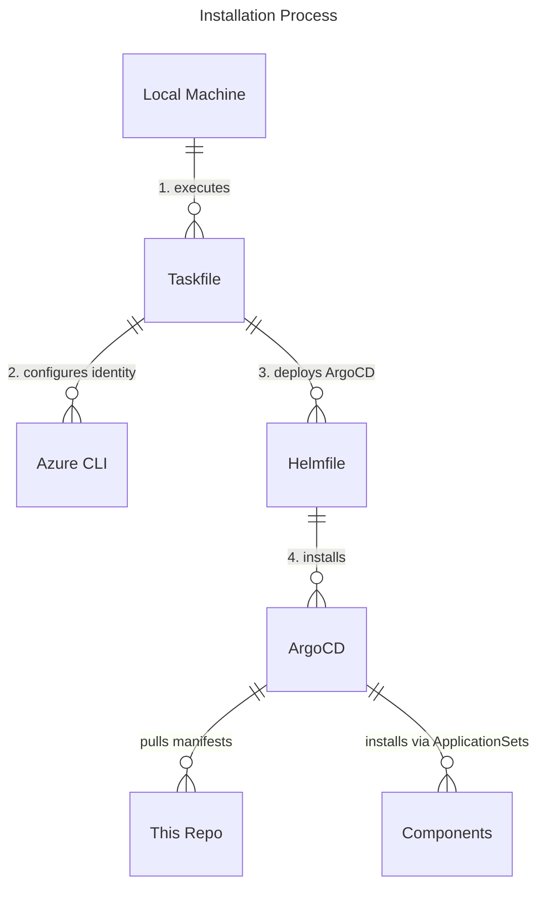

> **_NOTE:_** Applications deployed in this repository are not meant or configured for production.

# CNOE Azure Reference Implementation

This repository provides a reference implementation for deploying Cloud Native Operations Enabler (CNOE) components on Azure Kubernetes Service (AKS) using GitOps principles.

## Prerequisites

Before using this reference implementation, you **MUST** have the following Azure resources already created and configured:

### Required Azure Resources

1. **AKS Cluster** (1.27+) with:
   - OIDC Issuer enabled (`--enable-oidc-issuer`)
   - Workload Identity enabled (`--enable-workload-identity`)
   - Sufficient node capacity for all components

2. **Azure DNS Zone**
   - A registered domain with Azure DNS as the authoritative DNS service
   - DNS zone must exist in the same subscription and resource group

3. **Azure Key Vault**
   - For storing configuration secrets and certificates
   - Must be accessible from the AKS cluster

4. **Crossplane Workload Identity**
   - Azure Managed Identity with appropriate permissions
   - Federated credentials configured for the AKS cluster OIDC issuer

> **Important**: These resources are prerequisites and must be provisioned using your organization's preferred infrastructure management approach (Terraform, Bicep, ARM templates, etc.). The tasks in this repository that create Azure resources (`azure:creds:create`, `test:aks:create`, etc.) are helper functions for demonstration purposes only and are **NOT recommended for production deployments**.

### Setup Guidance

For setting up the prerequisite resources, refer to the official Azure documentation:

- [Create an AKS cluster](https://docs.microsoft.com/en-us/azure/aks/kubernetes-walkthrough)
- [Azure DNS zones](https://docs.microsoft.com/en-us/azure/dns/)
- [Azure Key Vault](https://docs.microsoft.com/en-us/azure/key-vault/)
- [Azure Workload Identity](https://azure.github.io/azure-workload-identity/)

## Architecture

- Installation is managed through **Taskfile** and **Helmfile**
- Components are deployed as **ArgoCD Applications**
- Uses **Azure Workload Identity** for secure authentication to Azure services
- Files under the `/packages` directory are meant to be usable without modifications
- Configuration is externalized through the `config.yaml` file

## Installation Flow

The installation process follows this pattern:

1. Configure your environment settings in `config.yaml`
2. Run `task install` which:
   - Sets up Azure Workload Identity credentials
   - Deploys ArgoCD via Helmfile
   - Creates ArgoCD ApplicationSets that deploy all other components
   - Configures workload identities and RBAC automatically



## Requirements

- **Azure CLI** (2.13+) with subscription access
- **kubectl** (1.27+)
- **kubelogin** for AKS authentication
- **yq** for YAML processing
- **jq** for JSON processing
- **curl** and **git**
- **helm** (3.x)
- **helmfile**
- **task** (Taskfile executor)
- A **GitHub Organization** (free to create)

## GitHub Integration Setup

### Create GitHub App for Backstage

You need a GitHub App to enable Backstage integration with your GitHub organization.

**Option 1: Using Backstage CLI (Recommended)**

```bash
npx '@backstage/cli' create-github-app ${GITHUB_ORG_NAME}
# Select appropriate permissions when prompted
# Install the app to your organization in the browser

# Move the credentials file to a temporary location
mkdir -p private
GITHUB_APP_FILE=$(ls github-app-* | head -n1)
mv ${GITHUB_APP_FILE} private/github-integration.yaml
```

**Option 2: Manual Creation**
Follow [Backstage GitHub App documentation](https://backstage.io/docs/integrations/github/github-apps) and save the credentials as `private/github-integration.yaml`.

> **Note**: The `private/` directory is for temporary files during development/testing only. All configuration must be properly stored in `config.yaml` for the actual deployment.

### Create GitHub Token

Create a GitHub Personal Access Token with these permissions:

- Repository access for all repositories
- Read-only access to: Administration, Contents, and Metadata

Save the token value temporarily for configuration in `config.yaml`.

## Installation

### 1. Configure the Installation

Copy and customize the configuration:

```bash
cp config.yaml.template config.yaml
# Edit config.yaml with your values
```

Key configuration sections in `config.yaml`:

- `repo`: Your fork details
- `cluster_name`: Your AKS cluster name
- `subscription`: Azure subscription ID
- `location`: Azure region
- `resource_group`: Azure resource group
- `cluster_oidc_issuer_url`: AKS OIDC issuer URL
- `domain`: Your domain name
- `keyvault`: Azure Key Vault name
- `github`: GitHub App credentials (from the app creation step)

### 2. Install Components

```bash
# Install all components
task install

# Or run individual steps:
task init     # Initialize and validate
task sync     # Deploy/update components (equivalent to helmfile sync)
task update   # Update configuration secrets
```

> **Important**: `task sync` is equivalent to `helmfile sync` and should not be confused with `task install`. Use `task sync` for updates after the initial installation.

### 3. Monitor Installation

Check ArgoCD UI for installation progress:

```bash
# Get ArgoCD admin password
kubectl -n argocd get secret argocd-initial-admin-secret -o jsonpath="{.data.password}" | base64 -d

# Port forward to ArgoCD
kubectl port-forward svc/argocd-server -n argocd 8080:80
```

Access ArgoCD at http://localhost:8080 with username `admin`.

### 4. Access Backstage

Once installation completes, access Backstage at:

- Domain routing: `https://backstage.YOUR_DOMAIN`
- Path routing: `https://YOUR_DOMAIN/backstage`

Login with default users:

```bash
# Get user passwords
kubectl get secrets -n keycloak keycloak-user-config -o go-template='{{range $k,$v := .data}}{{printf "%s: " $k}}{{if not $v}}{{$v}}{{else}}{{$v | base64decode}}{{end}}{{"\n"}}{{end}}'
```

## Deployed Components

| Component        | Version    | Purpose                        |
| ---------------- | ---------- | ------------------------------ |
| ArgoCD           | 8.0.14     | GitOps continuous deployment   |
| Crossplane       | 2.0.2-up.4 | Infrastructure as Code         |
| Ingress-nginx    | 4.7.0      | Ingress controller             |
| External-DNS     | 1.16.1     | Automatic DNS management       |
| External-secrets | 0.17.0     | Secret management              |
| Cert-manager     | 1.17.2     | TLS certificate management     |
| Keycloak         | 24.7.3     | Identity and access management |
| Backstage        | 2.6.0      | Developer portal               |
| Argo-workflows   | 0.45.18    | Workflow orchestration         |

## Access URLs

**Domain-based routing** (default):

- Backstage: `https://backstage.YOUR_DOMAIN`
- ArgoCD: `https://argocd.YOUR_DOMAIN`
- Keycloak: `https://keycloak.YOUR_DOMAIN`
- Argo Workflows: `https://argo-workflows.YOUR_DOMAIN`

**Path-based routing** (set `path_routing: true`):

- Backstage: `https://YOUR_DOMAIN/`
- ArgoCD: `https://YOUR_DOMAIN/argocd`
- Keycloak: `https://YOUR_DOMAIN/keycloak`
- Argo Workflows: `https://YOUR_DOMAIN/argo-workflows`

## Available Tasks

```bash
task init          # Initialize and validate configuration
task install       # Full installation
task sync          # Deploy/update components (equivalent to helmfile sync)
task diff          # Show pending changes
task update        # Update configuration secrets
task uninstall     # Remove all components

# Helper tasks (for demo/testing only):
task test:aks:create     # Create test AKS cluster (NOT for production)
task test:aks:destroy    # Delete test AKS cluster
task azure:creds:create  # Create Azure credentials (demo only)
task azure:creds:delete  # Delete Azure credentials (demo only)
```

> **Important**: Tasks prefixed with `test:` or `azure:creds:` are helper functions for demonstration and testing purposes only. They are **NOT recommended for production deployments**. Production infrastructure should be managed using your organization's standard infrastructure management practices.

## DNS and TLS Configuration

### Automatic (Recommended)

- Set your domain in `config.yaml`
- External-DNS manages DNS records automatically
- Cert-manager handles Let's Encrypt certificates

### Manual

- Set DNS records to point to the ingress load balancer IP
- Provide your own TLS certificates as Kubernetes secrets

## Uninstallation

```bash
# Remove all components
task uninstall

# Clean up GitHub App and tokens manually
# Delete the GitHub organization if no longer needed
```

## What's Next?

- See [DEMO.md](docs/DEMO.md) for usage examples
- Check [TROUBLESHOOTING.md](docs/TROUBLESHOOTING.md) for common issues
- Explore the Backstage templates in the `templates/` directory
- Customize component configurations in `packages/addons/values.yaml`

## Contributing

This reference implementation is designed to be:

- **Forkable**: Create your own version for your organization
- **Customizable**: Modify configurations without changing core packages
- **Extensible**: Add new components following the established patterns

## Troubleshooting

See [TROUBLESHOOTING.md](docs/TROUBLESHOOTING.md) for detailed troubleshooting steps.

## Security Notes

- GitHub App credentials contain sensitive information - handle with care
- Configuration secrets are stored in Azure Key Vault
- Workload Identity is used for secure Azure authentication
- All external traffic uses TLS encryption

## Important Notes

- **Azure Resource Management**: This repository does not manage Azure infrastructure. AKS cluster, DNS zone, Key Vault, and related resources must be provisioned separately using your organization's infrastructure management approach.
- **Production Readiness**: The helper tasks for creating Azure resources are for demo purposes only. Production deployments should follow enterprise infrastructure management practices.
- **Configuration Management**: All configuration is centralized in `config.yaml`. The `private/` directory is only for temporary files during development.
