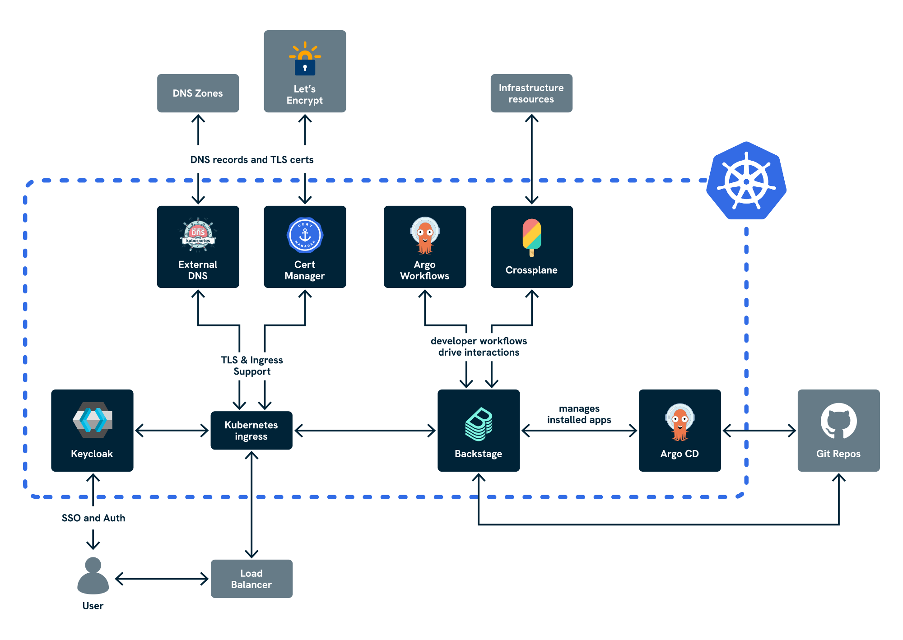

> **_NOTE:_** Applications deployed in this repository are not meant or configured for production.

<!-- omit from toc -->
# CNOE Azure Reference Implementation

This repository provides a reference implementation for deploying Cloud Native Operations Enabler (CNOE) components on Azure Kubernetes Service (AKS) using GitOps principles.

<!-- omit from toc -->
## Table of Contents

- [Architecture](#architecture)
  - [Deployed Components](#deployed-components)
- [Important Notes](#important-notes)
- [Prerequisites](#prerequisites)
  - [Required Azure Resources](#required-azure-resources)
    - [Setup Guidance for Azure Resources](#setup-guidance-for-azure-resources)
  - [GitHub Integration Setup](#github-integration-setup)
    - [Create GitHub App for Backstage](#create-github-app-for-backstage)
    - [Create GitHub Token](#create-github-token)
- [Installation Flow](#installation-flow)
- [Security Notes](#security-notes)
- [Installation Steps](#installation-steps)
  - [Installation Requirements](#installation-requirements)
  - [1. Configure the Installation](#1-configure-the-installation)
    - [DNS and TLS Configuration](#dns-and-tls-configuration)
      - [Automatic (Recommended)](#automatic-recommended)
      - [Manual](#manual)
  - [2. Install Components](#2-install-components)
  - [3. Monitor Installation](#3-monitor-installation)
  - [4. Get Access URLs](#4-get-access-urls)
  - [5. Access Backstage](#5-access-backstage)
- [Usage](#usage)
- [Update Component Configurations](#update-component-configurations)
  - [Backstage Templates](#backstage-templates)
- [Uninstall](#uninstall)
- [Contributing](#contributing)
- [Troubleshooting](#troubleshooting)
- [Potential Enhancements](#potential-enhancements)
- [Manual Seed Bootstrap](#manual-seed-bootstrap)

## Architecture

- Installation is managed through **Taskfile** and **Helmfile**
  - See [TASKFILE.md](./docs/TASKFILE.md) for information about the tasks defined in the `Taskfile.yml` file.
- Components are deployed as **ArgoCD Applications**
- Uses **Azure Workload Identity** for secure authentication to Azure services
- Files under the `/packages` directory are meant to be usable without modifications
- Configuration is externalised through the `config.yaml` file

## How It Works

- `seed/crossplane-install.yaml` installs the Crossplane core controllers (same output as the official Helm chart, rendered once for reuse).
- `seed/seed-kickoff.yaml` declares the supporting primitives: provider packages (Azure & Helm), the patch-and-transform function, a small RBAC bundle, and the pipeline-based composition (`SeedInfrastructure`) that wires those pieces together.
- You edit a single manifest, `seed/seed-infrastructure-claim.yaml`, filling in the Azure-specific values (domain, resource group, subscription, tenant, workload-identity IDs, client secret, etc.). Applying the claim generates the Azure service-principal secret and the composed resources automatically.
- The complete bootstrap sequence is therefore:
  ```bash
  kind create cluster --config kind.yaml --name seed
  kind get kubeconfig --name seed > private/seed-kubeconfig
  export KUBECONFIG=$(pwd)/private/seed-kubeconfig
  kubectl apply -f seed/crossplane-install.yaml
  kubectl wait deployment/crossplane -n crossplane-system --for=condition=Available --timeout=10m
  kubectl wait deployment/crossplane-rbac-manager -n crossplane-system --for=condition=Available --timeout=10m
  kubectl create secret generic cnoe-kubeconfig -n crossplane-system --from-file=kubeconfig=private/kubeconfig
  kubectl apply -f seed/seed-kickoff.yaml
  kubectl apply -f seed/seed-infrastructure-claim.yaml   # populated from the example template
  ```
- Crossplane then reconciles the Azure-facing resources (service-principal secret, Key Vault, wildcard DNS record) and installs Argo CD plus the ApplicationSet controller via `provider-helm` releases. The published ApplicationSet chart (see `charts/`) renders the full suite of addon ApplicationSets, driven entirely by the claim parameters (Azure IDs, repo metadata, routing flags, GitHub App credentials).
- Provide an accessible Helm repository for the ApplicationSet chart (set `appsetChartRepository`, `appsetChartName`, and `appsetChartVersion` in the claim). This can point to an OCI registry or a static chart archive you publish.
- The Helm provider expects the remote AKS kubeconfig to be available in `crossplane-system/<clusterConnectionSecretName>`; create this secret manually from the existing kubeconfig before applying the claim.
- Track progress with:
  ```bash
  kubectl get seedinfrastructureclaims.platform.livewyer.io
  kubectl get dnsarecord.network.azure.upbound.io
  ```

### Deployed Components

| Component        | Version    | Purpose                        |
| ---------------- | ---------- | ------------------------------ |
| ArgoCD           | 8.0.14     | GitOps continuous deployment   |
| Crossplane       | 2.0.2-up.4 | Infrastructure as Code         |
| Ingress-nginx    | 4.7.0      | Ingress controller             |
| ExternalDNS      | 1.16.1     | Automatic DNS management       |
| External-secrets | 0.17.0     | Secret management              |
| Cert-manager     | 1.17.2     | TLS certificate management     |
| Keycloak         | 24.7.3     | Identity and access management |
| Backstage        | 2.6.0      | Developer portal               |
| Argo-workflows   | 0.45.18    | Workflow orchestration         |

## Important Notes

- **Azure Resource Management**: The seed phase now assumes that only the AKS cluster and its parent DNS zone already exist. Crossplane compositions create or reconcile the supporting pieces (service-principal secret, Key Vault, wildcard DNS record, Helm provider configuration) once you supply those inputs and provide the remote kubeconfig as a Kubernetes secret.
- **Production Readiness**: The helper tasks in this repository are for creating Azure resources for demo purposes only. Any production deployments should follow enterprise infrastructure management practices.
- **Configuration Management**: All configuration is centralised in `config.yaml`. The `private/` directory is only for temporary files during development.

## Prerequisites

### Required Azure Resources

Before using this reference implementation, you **MUST** have the following Azure resources already created and configured:

1. **AKS Cluster** (1.27+) with:
   - OIDC Issuer enabled (`--enable-oidc-issuer`)
   - Workload Identity enabled (`--enable-workload-identity`)
   - Sufficient node capacity for all components
     - For example, the demonstration AKS cluster created with the helper task `azure:creds:create` has node pool with the node size set to `standard_d4alds_v6` by default 
2. **Azure DNS Zone**
   - A registered domain with Azure DNS as the authoritative DNS service
3. **Azure Key Vault**
   - Crossplane will create or reconcile this vault using the name you provide
   - Ensure the service principal in the claim has permissions to manage it
4. **Crossplane Workload Identity**
   - Azure Managed Identity with appropriate permissions
   - Federated credentials configured for the AKS cluster OIDC issuer

> **Important**: 
> - The AKS cluster and DNS zone must live in the same subscription and resource group; the claim uses those identifiers directly.
> - Crossplane can (re)create the Key Vault and wildcard record, but your service principal needs sufficient rights over the subscription/resource group.
> - Helper `task` targets that scaffold Azure resources remain for demos only; rely on your organisation's IaC workflows for persistent environments.

#### Setup Guidance for Azure Resources

For setting up the prerequisite Azure resources, refer to the official Azure documentation:

- [Create an AKS cluster](https://docs.microsoft.com/en-us/azure/aks/kubernetes-walkthrough)
- [Azure DNS zones](https://docs.microsoft.com/en-us/azure/dns/)
- [Azure Key Vault](https://docs.microsoft.com/en-us/azure/key-vault/)
- [Azure Workload Identity](https://azure.github.io/azure-workload-identity/)

### GitHub Integration Setup

#### Create GitHub App for Backstage

You need a GitHub App to enable Backstage integration with your GitHub organisation.

**Option 1: Using Backstage CLI (Recommended)**

```bash
npx '@backstage/cli' create-github-app ${GITHUB_ORG_NAME}
# Select appropriate permissions when prompted
# Install the app to your organisation in the browser

# Move the credentials file to a temporary location
mkdir -p private
GITHUB_APP_FILE=$(ls github-app-* | head -n1)
mv ${GITHUB_APP_FILE} private/github-integration.yaml
```

**Option 2: Manual Creation**
Follow [Backstage GitHub App documentation](https://backstage.io/docs/integrations/github/github-apps) and save the credentials as `private/github-integration.yaml`.

> **Note**: The `private/` directory is for temporary files during development/testing only. All configuration must be properly stored in `config.yaml` for the actual deployment.

#### Create GitHub Token

Create a GitHub Personal Access Token with these permissions:

- Repository access for all repositories
- Read-only access to: Administration, Contents, and Metadata

Save the token value temporarily as you will need it when creating the `config.yaml` file.

## Installation Flow

The installation process follows this pattern:

1. Configure your environment settings in `config.yaml`
   - The [Installation](#installation) process will include creating a `config.yaml` file using the [`config.yaml.template`](https://github.com/livewyer-ops/reference-implementation-azure/blob/v2/config.yaml.template) in this repository
2. Run `task install` which:
   - Sets up Azure Workload Identity credentials
   - Deploys ArgoCD via Helmfile
   - Creates ArgoCD ApplicationSets that deploy all other components
   - Configures workload identities and RBAC automatically


## Security Notes

- GitHub App credentials contain sensitive information - handle with care
- Configuration secrets are stored in Azure Key Vault
- Workload Identity is used for secure Azure authentication
- TLS encryption is used for all external traffic

## Installation Steps

### Installation Requirements

- **Azure CLI** (2.13+) with subscription access
- **kubectl** (1.27+)
- **kubelogin** for AKS authentication
- **yq** for YAML processing
- **jq** for JSON processing
- **curl** and **git**
- **helm** (3.x)
- **helmfile**
- **task** (Taskfile executor)
- A **GitHub Organisation** (free to create)

### 1. Configure the Installation

Copy and customise the configuration:

```bash
cp config.yaml.template config.yaml
# Edit config.yaml with your values
```

Key configuration sections in `config.yaml`:

- `repo`: The details of the repository hosting the reference azure implementation code
- `cluster_name`: Your AKS cluster name
- `subscription`: Your Azure subscription ID
- `location`: The target Azure region
- `resource_group`: Your Azure resource group
- `cluster_oidc_issuer_url`: The AKS OIDC issuer URL
- `domain`: The base domain name you will be using for exposing services
- `keyvault`: Your Azure Key Vault name
- `github`: GitHub App credentials (from the [Github Integration Setup](#github-integration-setup))

#### DNS and TLS Configuration

##### Automatic (Recommended)

- Set your domain in `config.yaml`
- ExternalDNS manages DNS records automatically
- Cert-manager handles Let's Encrypt certificates

##### Manual

- Set DNS records to point to the ingress load balancer IP
- Provide your own TLS certificates as Kubernetes secrets

### 2. Install Components

If installing the reference implementation on a machine for the first time run:

```bash
task init
```

If you haven't previously run `task init`, then you will be prompted to install several Helm plugins required by Helmfile when you run the next command:

```bash
# Install all components
task install
```

> **Notes**: 
> - `task install` will update the `config.yaml` file
> - Post-installation, use `task sync` (the equivalent to running `helmfile sync`) to apply updates. See the [Task Usage Guidelines](docs/TASKFILE.md) for more information.

### 3. Monitor Installation

Once ArgoCD is running, monitor the installation progress of the other components by checking the Argo CD UI:

```bash
# Get ArgoCD admin password
kubectl -n argocd get secret argocd-initial-admin-secret -o jsonpath="{.data.password}" | base64 -d

# Port forward to ArgoCD
kubectl port-forward svc/argocd-server -n argocd 8080:80
```

Access the ArgoCD UI at http://localhost:8080 with username `admin`.

### 4. Get Access URLs

Use the `task get:urls` command to fetch all the URLs. 

The URL structure of the URLs will depend on the type of routing you set in the configuration. Examples of the set of URLs that can be outputted are below:

**Domain-based routing** (default):

- Backstage: `https://backstage.YOUR_DOMAIN`
- ArgoCD: `https://argocd.YOUR_DOMAIN`
- Keycloak: `https://keycloak.YOUR_DOMAIN`
- Argo Workflows: `https://argo-workflows.YOUR_DOMAIN`

**Path-based routing** (set `path_routing: true`):

- Backstage: `https://YOUR_DOMAIN/`
- ArgoCD: `https://YOUR_DOMAIN/argocd`
- Keycloak: `https://YOUR_DOMAIN/keycloak`
- Argo Workflows: `https://YOUR_DOMAIN/argo-workflows`

### 5. Access Backstage

Once the Keycloak and Backstage are installed, check you can login to the Backstage UI with a default user:

```bash
# Get user password
kubectl -n keycloak get secret keycloak-config -o yaml | yq '.data.USER1_PASSWORD | @base64d'
```

## Usage

See [DEMO.md](docs/DEMO.md) for information on how to navigate the platform and for usage examples.

## Update Component Configurations

If you want to try customising component configurations, you can do so by updating the `packages/addons/values.yaml` file and using `task sync` to apply the updates.

### Backstage Templates

Backstage templates can be found in the `templates/` directory

## Uninstall

```bash
# Remove all components
task uninstall

# Clean up GitHub App and tokens manually
# Delete the GitHub organisation if no longer needed
```

## Contributing

This reference implementation is designed to be:

- **Forkable**: Create your own version for your organisation
- **Customizable**: Modify configurations without changing core packages
- **Extensible**: Add new components following the established patterns

## Troubleshooting

See [TROUBLESHOOTING.md](docs/TROUBLESHOOTING.md) for common issues and detailed troubleshooting steps.

## Manual Seed Bootstrap

The Taskfile-based seed flow has been retired. Use the minimal helper script or the manual KinD
instructions in [`docs/SEED_MANUAL.md`](docs/SEED_MANUAL.md).

```bash
./bootstrap.sh                         # expects private/kubeconfig to exist
# or REMOTE_KUBECONFIG=/path/to/aks kubeconfig ./bootstrap.sh
```

Prepare the claim manifest (located under `seed/`):

1. `seed-infrastructure-claim.yaml` – copy from `seed-infrastructure-claim.yaml.example`, then replace
   every placeholder with the values from your environment (Azure identifiers, repo metadata, GitHub App
   credentials, ApplicationSet chart location, etc.). Publish your ApplicationSet chart (e.g. by
   committing the packaged `.tgz` and `index.yaml` under `charts/` as done on branch `v2-seeding-codex`)
   and update `appsetChartRepository/appsetChartName/appsetChartVersion`
   accordingly. **Do not commit the populated file; it contains credentials and private keys.**

Create the kubeconfig secret referenced by your claim (defaults to `cnoe-kubeconfig`) using the credentials you already fetched for the remote cluster:

```bash
kubectl create secret generic cnoe-kubeconfig \
  -n crossplane-system \
  --from-file=kubeconfig=private/kubeconfig
```

Then apply everything with a single command (the composition renders the Azure service-principal secret,
Key Vault, and wildcard record, and reuses the kubeconfig secret you created above):

```bash
kubectl apply -f seed/
kubectl wait deployment/crossplane -n crossplane-system --for=condition=Available --timeout=10m
kubectl wait deployment/crossplane-rbac-manager -n crossplane-system --for=condition=Available --timeout=10m
```

When finished, delete the `azure-service-principal` secret from `crossplane-system`, remove
temporary files under `private/`, destroy the KinD cluster (`kind delete cluster --name seed`),
and remove `seed/seed-infrastructure-claim.yaml` (which contains the client secret). Remove the
`cnoe-kubeconfig` secret after the run and recreate it from fresh credentials whenever you rotate
remote cluster access.

## Potential Enhancements

The installation of this Azure reference implemenation will give you a starting point for the platform, however as previously stated applications deployed in this repository are not meant or configured for production. To push it towards production ready, you can make further enhancements that could include:

1. Modifying the basic and Argo workflow templates for your specific Azure use cases
2. Intergrating additional Azure services with Crossplane
3. Configuring auto-scaling for AKS and Azure resources
4. Adding OPA Gatekeeper for governance
5. Intergrating a monitoring stack. For example:
   1. Deploy Prometheus and Grafana
   2. Configure service monitors for Azure resources
   3. View metrics and Azure resource status in Backstage
6. Implementing GitOps-based environment promotion:
   1. **Development**: Deploy to dev environment via Git push
   2. **Testing**: Promote to test environment via ArgoCD
   3. **Production**: Use ArgoCD sync waves for controlled rollout
